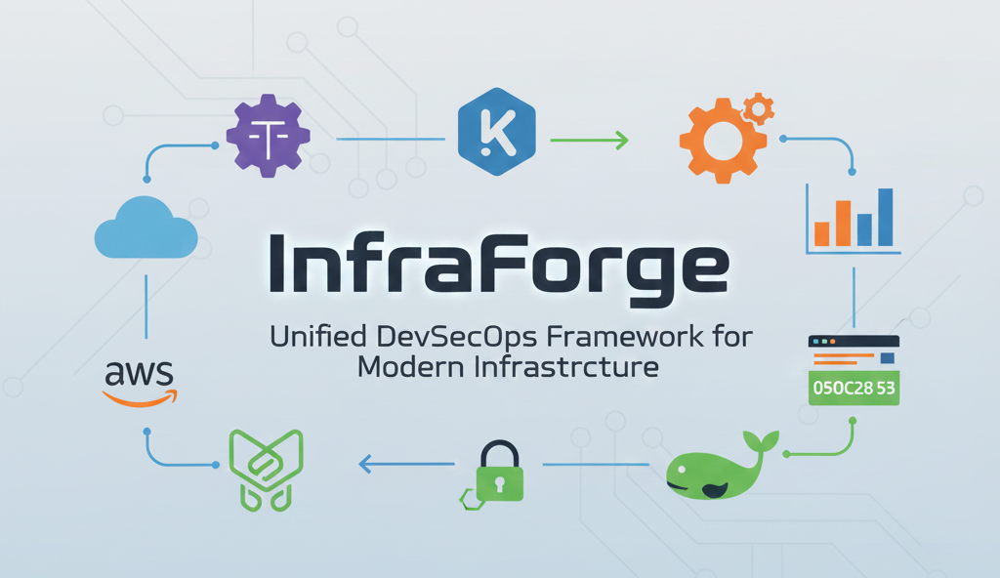
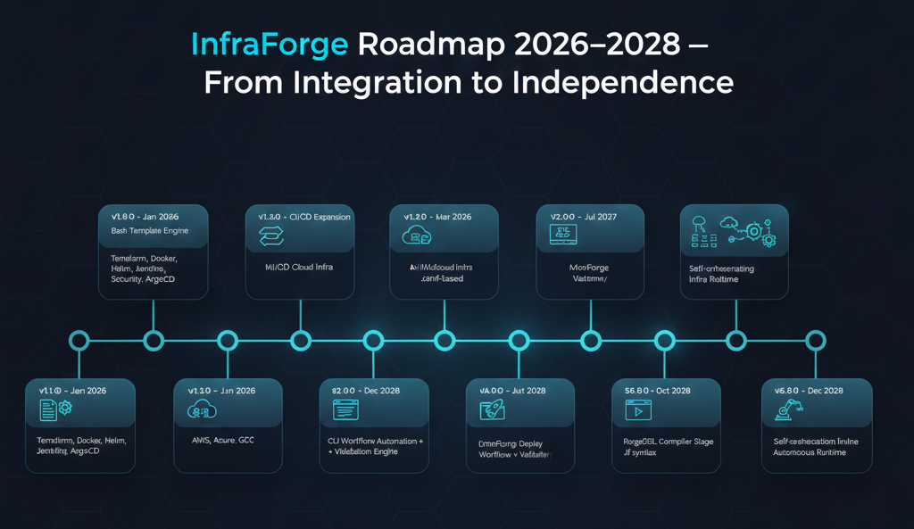

# 🛠️ InfraForge — Unified DevSecOps Framework

[](https://github.com/InfraForgeLabs/InfraForge/tags)
> 🏷️ **Latest Release:** Continuously evolving — Free · Local · Open · Forever

> ⚙️ Automate infrastructure, CI/CD, security, and monitoring — all from a single unified DevSecOps framework.

This repository hosts the official InfraForge domain:  
🌍 [https://infraforge.infraforgelabs.in](https://infraforge.infraforgelabs.in)

InfraForge is a free, local, and open infrastructure automation platform developed by **InfraForgeLabs**.  
The public domain will go live on **January 26, 2026 🇮🇳** under the *Free · Local · Open · Forever* philosophy.



---
## 🔐 Official Ownership & Identity

InfraForge is an open-source infrastructure automation and DevSecOps platform developed and maintained by InfraForge Labs.

🌐 **Official Website:** [https://infraforge.infraforgelabs.in](https://infraforge.infraforgelabs.in)

🏢 **Organization:** [https://infraforgelabs.in](https://infraforgelabs.in)
---

<!-- 🌐 Global Project Badges -->

[](https://github.com/gauravchile/InfraForge/tree/main/TerraformTemplates) [](https://github.com/gauravchile/InfraForge/tree/main/AnsibleTemplates) [](https://github.com/gauravchile/InfraForge/tree/main/DockerTemplates) [](https://github.com/gauravchile/InfraForge/tree/main/HelmTemplates) [](https://github.com/gauravchile/InfraForge/tree/main/K8sYamlTemplates) [](https://github.com/gauravchile/InfraForge/tree/main/ArgoCDTemplates) [](https://github.com/gauravchile/InfraForge/tree/main/JenkinsTemplates) [](https://github.com/gauravchile/InfraForge/tree/main/SecurityTemplates) [](https://github.com/gauravchile/InfraForge/tree/main/MonitoringTemplates) [](https://github.com/gauravchile/InfraForge/tree/main/MonitoringTemplates) [](https://github.com/gauravchile/InfraForge/tree/main/MonitoringTemplates) [](https://github.com/gauravchile/InfraForge/tree/main/AWSToolkit)

A complete **end-to-end DevSecOps framework** built for automation, scalability, and production readiness. This repository contains modular, GitHub-connected templates covering the **entire DevOps lifecycle** — from infrastructure provisioning to CI/CD, monitoring, and security.

_Part of the **InfraForgeLabs** open DevOps innovation ecosystem._

---

## 🧩 About This Project

The **InfraForge — Unified DevSecOps Framework** is a modular, automation-first repository designed to unify Infrastructure-as-Code, CI/CD, and security automation under one ecosystem. Each tool and template is plug-and-play, production-ready, and directly linked to GitHub for live updates.

## 📘 Table of Contents
- [About This Project](#-about-this-project)
- [Repository Overview](#-repository-overview)
- [Quick Start](#️-quick-start)
- [Features](#-features)
- [Deployment Options](#-deployment-options)
- [Integrations](#-integrations)
- [Contribution](#️-contribution)
- [Roadmap](#-infraforge-roadmap-20262028)
- [Support](#-support--credits)


### 🔧 Included Frameworks

* **Infrastructure:** Terraform, Ansible, Helm, Docker, Kubernetes YAMLs
* **CI/CD & GitOps:** Jenkins, ArgoCD
* **Observability:** Prometheus, Grafana, Loki
* **Security:** Compliance, Hardening, Scanning Templates
* **Automation Scripts:** Smart CLI generators for each tool
* **NEW:** 🧰 **AWSToolkit** — your CLI-based AWS automation suite for managing EC2, S3, IAM, Lambda, RDS, EKS, CloudFormation, and more.

---

## 🧹 Repository Overview

```
InfraForge/
├── AWSToolkit/ # AWS automation modules (EC2, S3, Lambda, IAM, etc.)
├── AnsibleTemplates/ # Playbooks, roles, inventories
├── ArgoCDTemplates/ # GitOps apps, projects, RBAC, notifications
├── DockerTemplates/ # Dockerfiles & Compose stacks (dev/prod)
├── HelmTemplates/ # Helm charts (minimal & production)
├── JenkinsTemplates/ # CI/CD pipelines + addons (Sonar, Trivy, ZAP)
├── K8sYamlTemplates/ # Kubernetes YAMLs (dev, prod, addons)
├── MonitoringTemplates/ # Prometheus, Grafana, Loki, Alertmanager
├── SecurityTemplates/ # SAST, DAST, SCA, policy, secrets scanning
├── TerraformTemplates/ # IaC modules & environments (AWS/Azure/GCP)
│
├── lib/ # Core engine & stack generators
├── bin/ # `infraforge` CLI entrypoint
├── foundation/ # Philosophy, roadmap & business docs
├── assets/ # Logos, banners, roadmap visuals
├── install.sh # One-line installer (curl | bash)
├── LICENSE # MIT License
└── README.md # Main documentation
```
## 💡 Highlights

* 9 core stacks: Terraform, Ansible, Docker, Helm, Jenkins, Monitoring, Security, ArgoCD, AWS

* Works fully local or online

* Unified via infraforge gen <stack>

---

### ⚙️ Quick Start

Get started with InfraForge instantly — no dependencies beyond `git` and `curl`.

## Installation

```bash
curl -fsSL https://raw.githubusercontent.com/InfraForgeLabs/InfraForge/main/install.sh | sudo bash
```
## Uninstall

```bash
curl -fsSL https://raw.githubusercontent.com/InfraForgeLabs/InfraForge/main/install.sh | sudo bash -s uninstall
```

## Verification

```bash
infraforge version
infraforge list
```

## 🌐  `--help` Flag Support

Each generator script supports a built-in **`--help`** flag for quick command reference and CLI automation.

```bash
infraforge --help
infraforge gen <stack> --help
```

### Applies to all Stacks:

* Terraform
* Ansible
* Docker
* Helm
* Kubernetes
* Jenkins
* Monitoring
* Security
* ArgoCD

---

### Generate templates interactively

Each script auto-fetches the latest files from GitHub and supports offline fallback.

#### Example Commands:

```bash
infraforge gen terraform     # Terraform Infra
infraforge gen docker       # Docker & Compose
infraforge gen helm         # Helm Charts
infraforge gen jenkins      # Jenkins Pipelines
infraforge gen monitoring   # Monitoring Stack
infraforge gen security     # Security Templates
infraforge gen argocd       # GitOps (Argo CD)
```
## For Templates Verification

```bash
infraforge show <stack> <project>
```

---

## 🌐 Features

* 🌍 **Online + Offline support** — auto-fetches from GitHub or uses local fallback.
* 🧱 **Modular architecture** — every folder works standalone.
* 🧠 **Smart YAML generation** — replaces placeholders automatically.
* 🔐 **Security-first templates** — with vaults, secrets, and compliance rules.
* ⚙️ **CI/CD integrated** — easily connects with Jenkins, ArgoCD, and Terraform.
* 🧹 **Observability-ready** — full Prometheus + Grafana + Loki + Alertmanager setup.
* ☁️ **AWS Toolkit Integration** — manage EC2, S3, IAM, Lambda, CloudFormation, and more directly.

---

## 📡 Deployment Options

| Stack      | Deployment Method                       |
| ---------- | --------------------------------------- |
| Kubernetes | `kubectl apply -f` or `kustomize build` |
| Helm       | `helm install app helm/`                |
| Argo CD    | Declarative GitOps apps                 |
| Terraform  | `terraform apply`                       |
| Ansible    | `ansible-playbook site.yml`             |
| Jenkins    | Pipeline-as-Code (Jenkinsfile)          |
| Monitoring | Helm/Kustomize/Direct YAMLs             |

---

## 🔗 Integrations

| Tool                   | Integration Purpose                 |
| ---------------------- | ----------------------------------- |
| **Terraform**          | Cloud infra provisioning            |
| **Kubernetes**         | App orchestration                   |
| **Helm**               | App deployment packaging            |
| **Jenkins**            | CI/CD automation                    |
| **Argo CD**            | GitOps continuous delivery          |
| **Ansible**            | Configuration management            |
| **Monitoring Stack**   | Observability & alerting            |
| **Security Templates** | Compliance, scanning, and hardening |
| **AWS Toolkit**        | Cloud automation via Bash CLI       |

---

## 📚 Project Foundation

These documents define the core philosophy, strategy, and business direction of **InfraForge** — the guiding framework for all development and roadmap decisions.

| File | Description |
|------|--------------|
| [`PHILOSOPHY`](foundation/PHILOSOPHY.md) | Vision, mission, and guiding principles of InfraForge |
| [`STRATEGY`](foundation/STRATEGY.md) | Long-term technical roadmap and execution strategy |
| [`BUSINESS_MODEL`](foundation/BUSINESS_MODEL.md) | Sustainable open-core business and funding approach |
| [`CHANGELOG`](foundation/CHANGELOG.md) | Version history and release roadmap (2026–2031) |

---

## 🛠️ Contribution

Want to extend this InfraForge?
Fork it, improve any module, and send a PR!

```bash
git checkout -b feature/new-module
# edit templates or scripts
git commit -m "✨ added new module"
git push origin feature/new-module
```

---

## 🗓️ InfraForge Roadmap (2026–2028)



---

## 📜 License

MIT License © 2025 InfraForgeLabs

---

## 💖 Support & Sponsorship

**InfraForge** is proudly built and maintained as an open-source DevSecOps framework.  

If you find this project useful, consider supporting its development — your contribution helps keep it active, updated, and community-driven.

### ☕ Ways to Support

- 💎 **GitHub Sponsors:** [Sponsor @gauravchile](https://github.com/sponsors/gauravchile)
- ☕ **Buy Me a Coffee:** [buymeacoffee.com/gauravchile](https://buymeacoffee.com/gauravchile)

> Every contribution — whether a coffee, a star ⭐, or a pull request — helps make InfraForge better for everyone.

---

## ⭐ Support & Credits

Developed & maintained by [Gaurav Chile](https://github.com/gauravchile)

Founder, **InfraForgeLabs**

> 💡 Tip: All generator scripts auto-update from GitHub — no manual sync needed.
> Perfect for DevOps learners, professionals, or teams building scalable infra-as-code.

[]()

---
